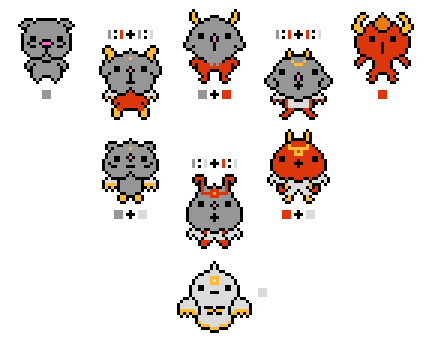
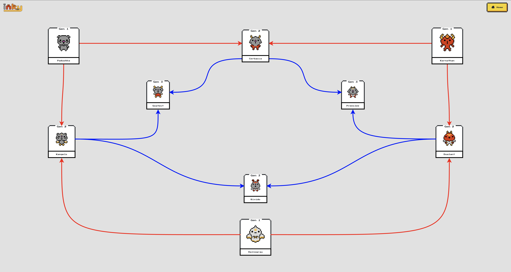

[![MIT License][license-shield]][license-url]
[![LinkedIn][linkedin-shield]][linkedin-url]

<!-- PROJECT LOGO -->
<br />
<p align="center">
  <a href="https://github.com/amamenko/inky-doodle">
    
  </a>

  <h3 align="center">Inky Doodle</h3>

  <p align="center">
    Single-Page Application (SPA) Integrated with Contentful
    <br />
    <br />
    <a href="https://inkydoodle.ml">View Demo</a>
    ·
    <a href="https://www.youtube.com/watch?v=VPKyCoFkgS0">Watch Video Demo</a>
    ·
    <a href="https://github.com/amamenko/inky-doodle/issues">Report Issue</a> 
    ·
    <a href="https://www.instagram.com/inkydoodle.ml">Follow @inkydoodle.ml</a> 
  </p>
</p>

## Overview

Inky Doodle is a single-page application (SPA) that illustrates and explores the biological concepts of hybridization and heredity with the use of imaginary species of "Inky Doodles." The website also has a [Pokédex](https://www.pokemon.com/us/pokedex/)-like search functionality. The website includes a landing page that allows the user to navigate to a Frequently Asked Questions (FAQ) page, a Search Inky Doodle page, a Pedigree Chart page, and a Contact Us page.

### Search Functionality

The search functionality gives users the ability to look up Inky Doodles by name or ID number. This search input queries the Inky Doodle Contentful database and shows all the matching Inky Doodles in a paginated result page format. Users can then click on a desired Inky Doodle preview thumbnail to open up that specific Inky Doodle's full profile. This profile includes their picture, name, number, parents, children, and Instagram history. If the Inky Doodle has already been posted to the [@inkydoodle.ml](https://www.instagram.com/inkydoodle.ml) Instagram page, then users can see when it was posted and also click a link that leads to that specific post. Otherwise, the scheduled date for that Inky Doodle's post will be shown.

In the Inky Doodle profile, any parent (if not the same as the Inky Doodle itself) or child can be clicked to view the associated parent or child's profile. Users can traverse back and forth through nested profiles easily since the profile states are stored and manipulated through a stack data structure (last in, first out).

### Contact Page

The contact page includes a form (consisting of a name, email, and any questions/comments) that is connected to a [Getform.io](https://getform.io) endpoint. This endpoint is, in turn, connected to an email associated with Inky Doodle that receives the form when it is submitted. The form inputs then reset after submission.

### Pedigree Chart

An additional feature of the application is a tree-structured pedigree chart with three generations. The first generation has a left tree and a right tree with spaces for two
sets of parents. These parents can then be bred to form second generation offspring, which can, in turn, be bred to potentialy create third generation offspring.
Second-generation Inky Doodle mates can only produce viable offpspring if either one or both mates are purebreds or, in the case of both second-generation mates being F1 (filial 1) hybrids, if at least one of each mate's parents is of the same species.
The seven possible combinations of the three generations are as follows, where capital letters (e.g. A, B) designate purebred parents, mixed letters (e.g. Ab, Bc) designate hybrids, and
arrows designate breeding to create a new generation:

<p align="center">A, A, A, A &rarr; A, A &rarr; A</p>
<p align="center">A, A, A, B &rarr; A, Ab &rarr; A</p>
<p align="center">A, A, B, B &rarr; A, B &rarr; Ab</p>
<p align="center">A, A, B, C &rarr; A, Bc &rarr; Abac</p>
<p align="center">A, B, A, B &rarr; Ab, Ab &rarr; Ab</p>
<p align="center">A, B, A, C &rarr; Ab, Ac &rarr; Abac</p>
<p align="center">A, B, C, D &rarr; Ab, Cd &rarr; No Match</p>

### Circle Mode

This feature is similar to the pedigree tree except it includes an additional generation 1 parent.

Generation 2 Inky Doodles can only breed with other generation 2 Inky Doodles that share a parent with them. This means that any two generation 2 Inky Doodles will have a natural third partner that is the child of the two parents they don't share.

This results in 3 triangular-shaped relationships that make up a pedigree "circle": the three generation 1 parents, the three generation 2s that the generation 1 parents create, and the three generation 3 cousins that result from the pairing of the generation 2 offspring.

### Deployment

The project was deployed to [Vercel](https://vercel.com). The custom domain was acquired from [Freenom](https://www.freenom.com/en/index.html?lang=en). DNS routing provided by [Cloudflare](https://www.cloudflare.com).

<br />

## UX / UI

<br /> 
<p align="center">
<a href="https://inkydoodle.ml">
    
</a>
</span>
<br/ >
<br />

The application was built by using React, [Styled Components](https://github.com/styled-components/styled-components), and [NES.css](https://github.com/nostalgic-css/NES.css).
All Inky Doodle information including names, parent information, images, and order number are stored in a [Contentful](https://www.contentful.com/) space and queried as needed by using Contentful's [Content Delivery API](https://www.contentful.com/developers/docs/references/content-delivery-api).

Inky Doodles are the intellectual property of Alex Jaloza. Inky Doodle assets, info, and initial design mockups courtesy of Alex Jaloza.

<br />

<p align="center">
  
   
</p>

<br />

As opposed to the initial design mock-ups for the Pedigree Tree, which just included the Inky Doodle's name underneath each individual parent's tree node, the production application added generational title indicators underneath each node. These allow for the dynamic setting of the Inky Doodle tree structure.

First generation parent dropdowns in the Pedigree Tree also highlight names (with appropriate associated Inky Doodle colors) of parent species selected on the opposite side of the tree
to suggest a next selection that will produce a successful generation 3 offspring.

A randomizer button was also added to the Pedigree Tree in production that automatically selects first generation parents according to one of the seven breeding combinations mentioned in the introduction.

<br />

<p align="center">
  
   
</p>

<br />

Similarly, as opposed to the preliminary sketch, the production feature of Circle Mode includes generational title indicators and each Inky Doodle's name under each Inky Doodle's associated image. Arrows are also included to better illustrate the relationship that each generation 2 and generation 3 Inky Doodles have to their parents.

Red arrows indicate generation 1 pairings that form generation 2 offspring. Blue arrows indicate generation 2 pairings that form generation 3 offspring.

## Automated Server-side Instagram Posting

The project also incudes an [Express](https://expressjs.com) server that posts a new Inky Doodle from [Contentful](https://www.contentful.com/) with a custom caption (including the Inky Doodle's name, ID number, parents, if any, and its generation) to the [@inkydoodle.ml](https://www.instagram.com/inkydoodle.ml) Instagram page every day at 4PM Eastern Time via [node-cron](https://www.npmjs.com/package/node-cron) and [instagram-web-api](https://www.npmjs.com/package/instagram-web-api).

The server logs in to Instagram initially with a username and password. It then persists the authenticated cookies in a cookie store via [tough-cookie-filestore2](https://www.npmjs.com/package/tough-cookie-filestore2) for future use. The Instagram link and date of posting for that particular Inky Doodle are then automatically stored via [the JavaScript SDK for Contentful's Content Management API](https://www.npmjs.com/package/contentful-management).

The server was initially deployed to [Heroku](https://www.heroku.com) and the Heroku dyno kept awake with [Kaffeine](https://kaffeine.herokuapp.com), but is now deployed on [AWS](https://aws.amazon.com). A video walkthrough of the code for this server can be found on [YouTube](https://www.youtube.com/watch?v=XzyYi_yv86A).

I have also created a [shorter tutorial on YouTube](https://www.youtube.com/watch?v=E46vCLlJ2Dw) going over the basics of automating daily Instagram posts with one static photo. This shorter tutorial centers around my other project called [Daily Pixel Mike](https://github.com/amamenko/daily-pixel-mike). This video also includes how to set up a cookie store via [tough-cookie-filestore2](https://www.npmjs.com/package/tough-cookie-filestore2), which the previous tutorial did not mention. It also includes random words generated daily using the [wordpos](https://www.npmjs.com/package/wordpos) library. The source code also shows how I implemented daily definitions for the randomly generated adjectives.

## Local Development

To set up this project locally, you can follow the steps below.

### Prerequisites

You will need to have the following software installed:

- npm
- Git
- Node.js

### Installation

1. Get a free Contentful space at [https://www.contentful.com](https://www.contentful.com) and create a model and associated content.
2. Clone the Github repository.
   ```sh
   git clone https://github.com/amamenko/inky-doodle.git
   ```
3. Install all server-side NPM packages.
   ```sh
   npm install
   ```
4. Add your server-side environment variables.
   ```JS
   INSTAGRAM_USERNAME=YOUR INSTAGRAM USERNAME
   INSTAGRAM_PASSWORD=YOUR INSTAGRAM PASSWORD
   CONTENTFUL_SPACE_ID=YOUR CONTENTFUL SPACE ID
   CONTENTFUL_ACCESS_TOKEN=YOUR CONTENTFUL ACCESS TOKEN
   CONTENTFUL_MANAGEMENT_TOKEN=YOUR CONTENTFUL MANAGEMENT TOKEN
   YOUR_EMAIL=YOUR EMAIL ADDRESS
   YOUR_EMAIL_PASSWORD=YOUR EMAIL PASSWORD
   ```
5. `cd` into the client-side directory.
   ```sh
   cd client
   ```
6. Install all client-side NPM packages.
   ```sh
   npm install
   ```
7. Enter your Contentful Content Delivery API credentials as client-side environment variables.
   ```JS
   REACT_APP_SPACE_ID=YOUR CONTENTFUL SPACE ID
   REACT_APP_ACCESS_TOKEN=YOUR CONTENTFUL ACCESS TOKEN
   REACT_APP_GETFORM_CONTACT_ENDPOINT=YOUR GETFORM URL ENDPOINT
   ```
8. Start the local server.
   ```JS
   npm start
   ```
9. Build for production.
   ```JS
   npm run build
   ```

<!-- CONTRIBUTING -->

## Contributing

Contributions are welcome!

1. Fork the project.
2. Create your feature branch (`git checkout -b feature/MyFeature`).
3. Commit your changes (`git commit -m 'Add my feature'`).
4. Push to the branch (`git push origin feature/MyFeature`).
5. Open a pull request.

<!-- LICENSE -->

## License

Distributed under the MIT License. See `LICENSE.txt` for more information.

<!-- CONTACT -->

## Contact

Avraham (Avi) Mamenko - avimamenko@gmail.com

Project Link: [https://github.com/amamenko/inky-doodle](https://github.com/amamenko/inky-doodle)

<!-- ACKNOWLEDGEMENTS -->

## Acknowledgements

- Alex Jaloza
- [Contentful](https://www.contentful.com/)
- [NES.css](https://github.com/nostalgic-css/NES.css)
- [react-select-nes-css-theme](https://www.npmjs.com/package/react-select-nes-css-theme)
- [Vercel](https://vercel.com)
- [Heroku](https://www.heroku.com)
- [AWS](https://aws.amazon.com)
- [instagram-web-api](https://www.npmjs.com/package/instagram-web-api)
- [Jimp](https://www.npmjs.com/package/jimp)
- [React Icons](https://react-icons.github.io/react-icons)
- [Getform.io](https://getform.io/)
- [React Spinners](https://www.npmjs.com/package/react-spinners)
- [Best-README-Template](https://github.com/othneildrew/Best-README-Template)

<!-- MARKDOWN LINKS & IMAGES -->
<!-- https://www.markdownguide.org/basic-syntax/#reference-style-links -->

[license-shield]: https://img.shields.io/github/license/othneildrew/Best-README-Template.svg?style=for-the-badge
[license-url]: https://github.com/amamenko/inky-doodle/blob/master/LICENSE.txt
[linkedin-shield]: https://img.shields.io/badge/-LinkedIn-black.svg?style=for-the-badge&logo=linkedin&colorB=555
[linkedin-url]: https://www.linkedin.com/in/avrahammamenko
